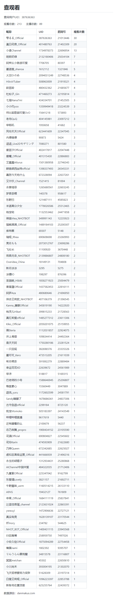
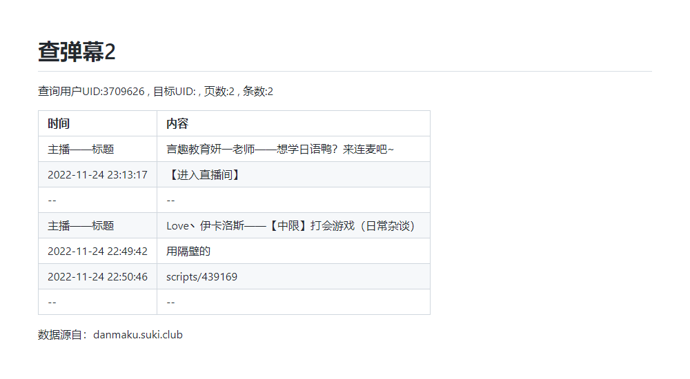

<div align="center">
  <a href="https://v2.nonebot.dev/store"></a>
  <br>
  <p></p>
</div>

<div align="center">

# nonebot_plugin_searchBiliInfo
  
_✨ NoneBot b站用户信息查询插件 ✨_
  
<a href="https://github.com/Ikaros-521/nonebot_plugin_searchBiliInfo/stargazers">
    
</a>
<a href="https://github.com/Ikaros-521/nonebot_plugin_searchBiliInfo/issues">
    
</a>
<a href="https://github.com/Ikaros-521/nonebot_plugin_searchBiliInfo/network">
    
</a>
<a href="./LICENSE">
    
</a>
<a href="https://pypi.python.org/pypi/nonebot_plugin_searchBiliInfo">
    
</a>
<a href="https://www.python.org">
    
</a>

</div>

适用于nonebot2 v11的b站用户信息查询插件【粉丝、舰团信息；直播收益数据；直播观看信息；关键词搜昵称、UID等；主播营收榜单】  
（ps：微调源码可以兼容其他版本）   
调用的相关API源自b站官方接口、danmakus.com和vtbs.fun

## 🔧 开发环境
Nonebot2：2.0.0b5  
python：3.8.13  
操作系统：Windows10（CentOS7下正常运行，Linux兼容性问题不大）  
编辑器：pycharm  

## 💿 安装
环境依赖`aiohttp`和`nonebot_plugin_htmlrender`库   
部分功能需要获取自己的cookie，配置env后才能正常使用！  

### 1. nb-cli安装（推荐）
在你bot工程的文件夹下，运行cmd（运行路径要对啊），执行nb命令安装插件，插件配置会自动添加至配置文件  
```
nb plugin install nonebot_plugin_searchBiliInfo
```

### 2. 本地安装
先安装下 `aiohttp` 和 `htmlrender`  
```
pip install aiohttp
pip install nonebot_plugin_htmlrender
```
将项目clone到你的机器人插件下的对应插件目录内（一般为机器人文件夹下的`src/plugins`），然后把`nonebot_plugin_searchBiliInfo`文件夹里的内容拷贝至上一级目录即可。  
clone命令参考（得先装`git`，懂的都懂）：
```
git clone https://github.com/Ikaros-521/nonebot_plugin_searchBiliInfo.git
``` 
也可以直接下载压缩包到插件目录解压，然后同样提取`nonebot_plugin_searchBiliInfo`至上一级目录。  
目录结构： ```你的bot/src/plugins/nonebot_plugin_searchBiliInfo/__init__.py```  


### 3. pip安装
```
pip install nonebot_plugin_searchBiliInfo
```  
打开 nonebot2 项目的 ```bot.py``` 文件, 在其中写入  
```nonebot.load_plugin('nonebot_plugin_searchBiliInfo')```  
当然，如果是默认nb-cli创建的nonebot2的话，在bot路径```pyproject.toml```的```[tool.nonebot]```的```plugins```中添加```nonebot_plugin_searchBiliInfo```即可  
pyproject.toml配置例如：  
``` 
[tool.nonebot]
plugin_dirs = ["src/plugins"]
plugins = ["nonebot_plugin_searchBiliInfo"]
``` 

### 更新版本
```
nb plugin update nonebot_plugin_searchBiliInfo
```

## 🔧 配置

### cookie获取方式
浏览器进入b站官网并登录: `https://www.bilibili.com/`  
edge（或其他浏览器）按f12（或鼠标右键“检查” “开发者工具”等）, 然后点击右上角那个">>"符号, 进入"网络"  
再按ctrl+r（或f5）刷新元素  
随便点击一个请求, 在“请求标头”里面找到cookie（没有就换一个）  
cookie冒号后面的就是cookie，复制一下, 可以把ta添加到env里  
如果不想放太多cookie信息，只需要buvid3字段即可。  

### env配置
```
# 在你的env文件中添加如下配置（我的是.env.prod） 仅需要buvid3字段即可
searchBiliInfo_cookie="buvid3=XXXXXXXX-XXXX-XXXX-XXXX-XXXXXXXXXXXXXXXXXinfoc;"
```
|       配置项        | 必填 | 默认值  |                      说明                      |
|:----------------:|:----:|:----:|:----------------------------:|
| `searchBiliInfo_cookie` | 否 | `""` | b站cookie，仅需要buvid3字段即可 |


## 🎉 功能
通过uid 或 设定好的短语 或 b站接口搜索查询指定b站用户的粉丝、舰团信息；直播收益数据；直播观看信息；关键词搜昵称、UID等信息；主播营收榜单。

## 👉 命令(命令前缀自行替换喵~)

### /查
命令结构：```/查 (uid:或UID:或：或:)+用户uid或昵称关键词```  
例如：```/查 uid:3709626``` 或 ```/查 :3709626``` 或 ```/查 bishi```  
bot返回内容：  


### /查直播
命令结构：```/查直播 (uid:或UID:或：或:)+用户uid或昵称关键词 场次数（默认不写为全部）```  
例如：```/查直播 UID:3709626 1``` 或 ```/查直播 bishi```  
bot返回内容（图片）：  


### /查舰团
命令结构：```/查舰团 (uid:或UID:或：或:)+用户uid或昵称关键词```  
例如：```/查舰团 ：3709626``` 或 ```/查舰团 bishi```  
bot返回内容(图片)：  


### /查昵称
命令结构：```/查昵称 昵称关键词```  
例如：```/查昵称 伊卡洛斯```
bot返回内容(图片)：  


### /查收益
命令结构：```/查收益 (uid:或UID:或：或:)+用户uid或昵称关键词 收益类型(默认1: 礼物，2: 上舰，3: SC) 倒叙第n场(从0开始)```  
例如：```/查收益 :3709626 礼物 1``` 或 ```/查收益 bishi 2 0```  
bot返回内容(图片)：  


### /查观看
命令结构：```/查观看 (uid:或UID:或：或:)+用户uid或昵称关键词```  
例如：```/查观看 UID:666666``` 或 ```/查观看 bishi```  
bot返回内容(图片)：  


### /查弹幕
命令结构：```/查弹幕 (uid:或UID:或：或:)+用户uid或昵称关键词 查询的主播昵称关键词或(uid:或UID:或：或:)+ 页数(可不填，默认0) 条数(可不填，默认3)```  
例如：```/查弹幕 uid:3709626 Love丶伊卡洛斯 1 1``` 或 ```/查弹幕 uid:3709626 Love丶伊卡洛斯 1```   
bot返回内容(图片)：  


### /查弹幕2
命令结构：```/查弹幕2 (uid:或UID:或：或:)+用户uid或昵称关键词 页数(可不填，默认0) 条数(可不填，默认3)```  
例如：```/查弹幕2 uid:3709626 2 2``` 或 ```/查弹幕2 uid:3709626 2```   
bot返回内容(图片)：  


### /营收
命令结构：```/营收 日/周/月榜 人数（不填默认100）```  
例如：```/营收 日榜 3``` 或 ```/营收 月榜```  
bot返回内容(图片)：  


### /涨粉
命令结构：```/涨粉 日/周/月榜 人数（不填默认100）```  
例如：```/涨粉 日榜 3``` 或 ```/涨粉 月榜```  
bot返回内容(图片)：  


### /DD风云榜 或 /dd风云榜 或 /风云榜
命令结构：```/DD风云榜 top人数（不填默认10）```  
例如：```/DD风云榜``` 或 ```/风云榜 20```  
bot返回内容(图片)：  


### /查牌子
命令结构：```/查牌子 主播牌子关键词```  
例如：```/查牌子 天``` 或 ```/查牌子 天降```  
bot返回内容(图片)：  


### vtb网站  （命令前缀自行添加）
命令结构：```/vtb网站``` 或 ```/vtb资源```  
例如：```/vtb网站``` 或 ```/vtb资源```  
bot返回内容(图片)：  


## ⚙ 拓展
启用关键词搜索，需要在env中配置自己的cookie。

命令修改：修改data.py，在文件头部追加你需要定义的用户的json串，注意json格式！！！

返回内容格式修改对应的msg、out_str变量的内容  

## 📝 更新日志

<details>
<summary>展开/收起</summary>

### 0.0.1

- 插件初次发布

### 0.1.0

- 更新基于vtbs.moe的主播数据，添加关键词搜索功能

### 1.0.0

新增以下功能（其实是LX_Bot的相关命令融进来了）
- /查 昵称关键词
- /查直播 昵称关键词 场次数
- /查舰团 昵称关键词
- /查昵称 昵称关键词
- /查收益 收益类型(默认1: 礼物，2: 上舰，3: SC) 用户uid或昵称关键词 倒叙第n场(从0开始)
- /查成分 观看 昵称关键词
- /查成分 弹幕 查询的目标人 查询的主播 页数 条数

### 1.0.4

优化针对uid解析方式

### 1.0.5

修改cookie配置从env获取，方便用户配置

### 1.0.6

修复 /查成分 弹幕 数据解析bug；
优化整体代码实现；

### 1.1.0
新增功能
- /营收 日/周/月榜 人数（不填默认100）

### 1.2.0
弃用requests库，改为aiohttp  

### 1.2.1
修复查命令aiohttp适配性bug  

### 1.3.0
修改 查成分 弹幕 和 查成分 观看 命令为 查弹幕 和 查观看。  
优化命令解析实现。  
修复查弹幕数据解析bug。  

### 1.3.1
新增 /查弹幕2 命令。  
修复查弹幕数据解析bug。 
图片UI优化。  

### 1.3.2
优化 /查弹幕2 命令，增加主播名。  

### 1.3.3
修复 /查观看 因为数据源有同一用户名不同uid的情况导致的越界bug。  

### 1.3.4
优化异常报错的处理。  
优化UI设计和部分功能。  

### 1.3.5
新增`/查收益 xx 舰长`和`uid：`的匹配。（但是舰长仍然是所有上舰数据）    

### 1.3.6
优化API挂彩时候的异常捕获处理。  

### 1.3.7
插件补充元信息。 

### 1.3.8
新增`vtb网站` 或 `vtb资源` 命令（命令前缀自行添加） 

## 1.3.9
补充2个VTB资源站点  

## 1.3.10
适配vtbs.fun的营收接口变动  

## 1.4.0
修改on_keyword为on_command，从而适配自定义的命令前缀  

## 1.4.1
修改danmakus.com到新域名danmakus.com，接口也同步替换了。  

## 1.4.2
新增markdown的特殊字符过滤和文本超长换行。  
ps：vtbs.fun挂了，`营收`功能暂时无法使用。

## 1.4.3
vtbs.fun活了，加了ssl，已兼容。  

## 1.4.4
新增命令 涨粉，接口源自vtbs.fun（和营收 基本一致）  

## 1.4.5
新增命令 DD风云榜，接口源自ddstats-api.ericlamm.xyz  

## 1.4.6
补充遗漏的插件元信息    

## 1.4.7
新增功能 查牌子，数据源自本地爬取（vtbs.moe中主播牌子信息，共4273条数据）   

## 1.4.8
补充插牌子遗漏的1条数据   

</details>

## 致谢
- [nonebot-plugin-htmlrender](https://github.com/kexue-z/nonebot-plugin-htmlrender) - 图片合成的好手
- [danmakus.com](https://danmakus.com/) - b站主播、用户弹幕直播信息等来源（开放API接口很赞！）
- [vtbs.moe](https://vtbs.moe) - VTB本地数据信息来源（还有数据提供，TQL）  

## 项目打包上传至pypi

官网：https://pypi.org，注册账号，在系统用户根目录下创建`.pypirc`，配置  
``` 
[distutils] 
index-servers=pypi 
 
[pypi] repository = https://upload.pypi.org/legacy/ 
username = 用户名 
password = 密码
```

### poetry

```
# 参考 https://www.freesion.com/article/58051228882/

# 1、安装poetry
pip install poetry

# 2、初始化配置文件（根据提示填写）
poetry init

# 3、微调配置文件pyproject.toml

# 4、运行 poetry install, 可生成 “poetry.lock” 文件（可跳过）
poetry install

# 5、编译，生成dist
poetry build

# 6、发布
poetry publish

```

### twine

```
# 参考 https://www.cnblogs.com/danhuai/p/14915042.html
#创建setup.py文件 填写相关信息

# 1、可以先升级打包工具
pip install --upgrade setuptools wheel twine

# 2、打包
python setup.py sdist bdist_wheel

# 3、可以先检查一下包
twine check dist/*

# 4、上传包到pypi（需输入用户名、密码）
twine upload dist/*
```
