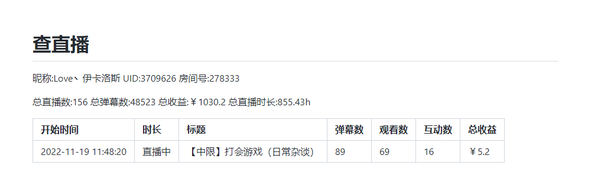
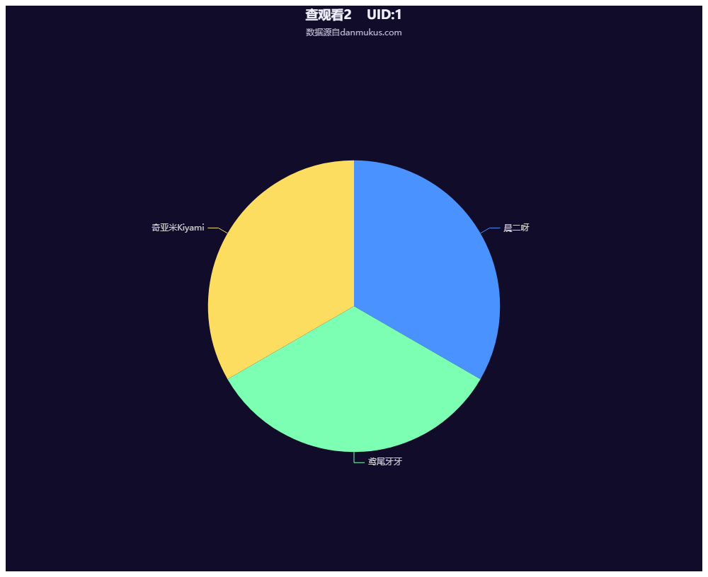
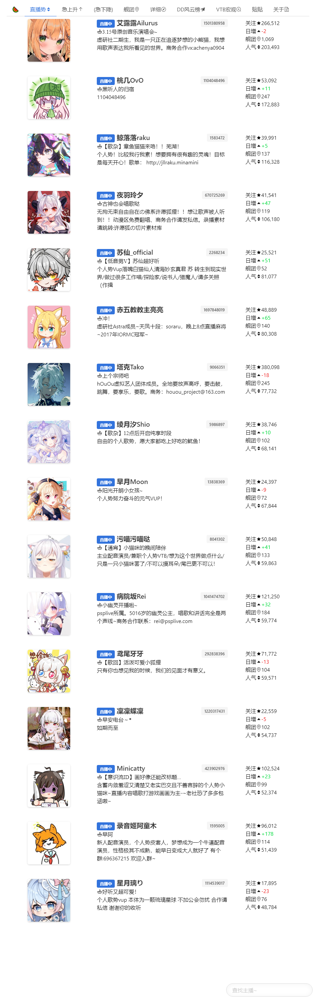
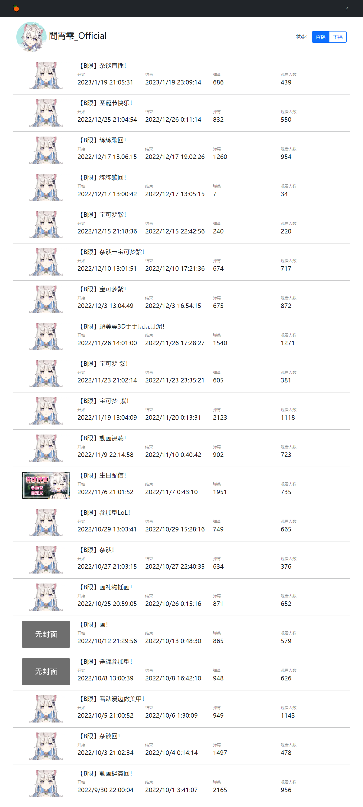

<div align="center">
  <a href="https://v2.nonebot.dev/store"></a>
  <br>
  <p></p>
</div>

<div align="center">

# nonebot_plugin_searchBiliInfo
  
_✨ NoneBot b站用户信息查询插件 ✨_
  
<a href="https://github.com/Ikaros-521/nonebot_plugin_searchBiliInfo/stargazers">
    
</a>
<a href="https://github.com/Ikaros-521/nonebot_plugin_searchBiliInfo/issues">
    
</a>
<a href="https://github.com/Ikaros-521/nonebot_plugin_searchBiliInfo/network">
    
</a>
<a href="./LICENSE">
    
</a>
<a href="https://pypi.python.org/pypi/nonebot_plugin_searchBiliInfo">
    
</a>
<a href="https://www.python.org">
    
</a>

</div>

适用于nonebot2 v11/red 的b站用户信息查询插件【粉丝、舰团信息；直播收益数据；直播观看信息；关键词搜昵称、UID；主播营收榜单；查成分；查牌子等】  
（ps：微调源码可以兼容其他版本）   
调用的相关API源自b站官方接口、danmakus.com和vtbs.fun  

本项目部分功能已经失效，多是第三方接口挂了，也懒得修了，不能用的功能就无视吧。  

<!-- START doctoc generated TOC please keep comment here to allow auto update -->
<!-- DON'T EDIT THIS SECTION, INSTEAD RE-RUN doctoc TO UPDATE -->
## 📖目录

- [🔧 开发环境](#-%E5%BC%80%E5%8F%91%E7%8E%AF%E5%A2%83)
- [💿 安装](#-%E5%AE%89%E8%A3%85)
  - [1. nb-cli安装（推荐）](#1-nb-cli%E5%AE%89%E8%A3%85%E6%8E%A8%E8%8D%90)
  - [2. 本地安装](#2-%E6%9C%AC%E5%9C%B0%E5%AE%89%E8%A3%85)
  - [3. pip安装](#3-pip%E5%AE%89%E8%A3%85)
  - [更新版本](#%E6%9B%B4%E6%96%B0%E7%89%88%E6%9C%AC)
- [🔧 配置](#-%E9%85%8D%E7%BD%AE)
  - [cookie获取方式](#cookie%E8%8E%B7%E5%8F%96%E6%96%B9%E5%BC%8F)
  - [env配置](#env%E9%85%8D%E7%BD%AE)
- [🎉 功能](#-%E5%8A%9F%E8%83%BD)
- [👉 命令(命令前缀自行替换喵~)](#-%E5%91%BD%E4%BB%A4%E5%91%BD%E4%BB%A4%E5%89%8D%E7%BC%80%E8%87%AA%E8%A1%8C%E6%9B%BF%E6%8D%A2%E5%96%B5)
  - [/查帮助](#%E6%9F%A5%E5%B8%AE%E5%8A%A9)
  - [/查](#%E6%9F%A5)
  - [/查直播](#%E6%9F%A5%E7%9B%B4%E6%92%AD)
  - [/查舰团](#%E6%9F%A5%E8%88%B0%E5%9B%A2)
  - [/查昵称](#%E6%9F%A5%E6%98%B5%E7%A7%B0)
  - [/查收益](#%E6%9F%A5%E6%94%B6%E7%9B%8A)
  - [/查观看](#%E6%9F%A5%E8%A7%82%E7%9C%8B)
  - [/查观看2](#%E6%9F%A5%E8%A7%82%E7%9C%8B2)
  - [/查弹幕](#%E6%9F%A5%E5%BC%B9%E5%B9%95)
  - [/查弹幕2](#%E6%9F%A5%E5%BC%B9%E5%B9%952)
  - [/查牌子](#%E6%9F%A5%E7%89%8C%E5%AD%90)
  - [/查人气](#%E6%9F%A5%E4%BA%BA%E6%B0%94)
  - [/查装扮](#%E6%9F%A5%E8%A3%85%E6%89%AE)
  - [/营收](#%E8%90%A5%E6%94%B6)
  - [/涨粉](#%E6%B6%A8%E7%B2%89)
  - [/DD风云榜 或 /dd风云榜 或 /风云榜 (寄了)](#dd%E9%A3%8E%E4%BA%91%E6%A6%9C-%E6%88%96-dd%E9%A3%8E%E4%BA%91%E6%A6%9C-%E6%88%96-%E9%A3%8E%E4%BA%91%E6%A6%9C-%E5%AF%84%E4%BA%86)
  - [/v详情 或 /V详情 或 /v详细 或 /V详细](#v%E8%AF%A6%E6%83%85-%E6%88%96-v%E8%AF%A6%E6%83%85-%E6%88%96-v%E8%AF%A6%E7%BB%86-%E6%88%96-v%E8%AF%A6%E7%BB%86)
  - [/v直播势 或 /V直播势](#v%E7%9B%B4%E6%92%AD%E5%8A%BF-%E6%88%96-v%E7%9B%B4%E6%92%AD%E5%8A%BF)
  - [/v急上升 或 /V急上升](#v%E6%80%A5%E4%B8%8A%E5%8D%87-%E6%88%96-v%E6%80%A5%E4%B8%8A%E5%8D%87)
  - [/v急下降 或 /V急下降](#v%E6%80%A5%E4%B8%8B%E9%99%8D-%E6%88%96-v%E6%80%A5%E4%B8%8B%E9%99%8D)
  - [/v舰团 或 /V舰团](#v%E8%88%B0%E5%9B%A2-%E6%88%96-v%E8%88%B0%E5%9B%A2)
  - [/vdd 或 /VDD 或 /VDD风云榜 或 /vdd风云榜](#vdd-%E6%88%96-vdd-%E6%88%96-vdd%E9%A3%8E%E4%BA%91%E6%A6%9C-%E6%88%96-vdd%E9%A3%8E%E4%BA%91%E6%A6%9C)
  - [/V宏观 或 /v宏观](#v%E5%AE%8F%E8%A7%82-%E6%88%96-v%E5%AE%8F%E8%A7%82)
  - [/dmk查用户 或 /DMK查用户](#dmk%E6%9F%A5%E7%94%A8%E6%88%B7-%E6%88%96-dmk%E6%9F%A5%E7%94%A8%E6%88%B7)
  - [/dmk查直播 或 /DMK查直播](#dmk%E6%9F%A5%E7%9B%B4%E6%92%AD-%E6%88%96-dmk%E6%9F%A5%E7%9B%B4%E6%92%AD)
  - [/dmk分析 或 /DMK分析](#dmk%E5%88%86%E6%9E%90-%E6%88%96-dmk%E5%88%86%E6%9E%90)
  - [/blg查弹幕 或 /BLG查弹幕](#blg%E6%9F%A5%E5%BC%B9%E5%B9%95-%E6%88%96-blg%E6%9F%A5%E5%BC%B9%E5%B9%95)
  - [/blg查入场 或 /BLG查入场](#blg%E6%9F%A5%E5%85%A5%E5%9C%BA-%E6%88%96-blg%E6%9F%A5%E5%85%A5%E5%9C%BA)
  - [/blg查礼物 或 /BLG查礼物](#blg%E6%9F%A5%E7%A4%BC%E7%89%A9-%E6%88%96-blg%E6%9F%A5%E7%A4%BC%E7%89%A9)
  - [/blg直播记录 或 /BLG直播记录](#blg%E7%9B%B4%E6%92%AD%E8%AE%B0%E5%BD%95-%E6%88%96-blg%E7%9B%B4%E6%92%AD%E8%AE%B0%E5%BD%95)
  - [/blg直播间sc 或 /BLG直播间SC](#blg%E7%9B%B4%E6%92%AD%E9%97%B4sc-%E6%88%96-blg%E7%9B%B4%E6%92%AD%E9%97%B4sc)
  - [/icu查直播 或 /ICU查直播 或 /matsuri查直播](#icu%E6%9F%A5%E7%9B%B4%E6%92%AD-%E6%88%96-icu%E6%9F%A5%E7%9B%B4%E6%92%AD-%E6%88%96-matsuri%E6%9F%A5%E7%9B%B4%E6%92%AD)
  - [/lap查用户 或 /LAP查用户](#lap%E6%9F%A5%E7%94%A8%E6%88%B7-%E6%88%96-lap%E6%9F%A5%E7%94%A8%E6%88%B7)
  - [/lap查牌子 或 /LAP查牌子](#lap%E6%9F%A5%E7%89%8C%E5%AD%90-%E6%88%96-lap%E6%9F%A5%E7%89%8C%E5%AD%90)
  - [/lap查充电 或 /LAP查充电](#lap%E6%9F%A5%E5%85%85%E7%94%B5-%E6%88%96-lap%E6%9F%A5%E5%85%85%E7%94%B5)
  - [/lapdd 或 /LAPDD 或 /lapdd排行榜](#lapdd-%E6%88%96-lapdd-%E6%88%96-lapdd%E6%8E%92%E8%A1%8C%E6%A6%9C)
  - [/zero查用户 或 /ZERO查用户](#zero%E6%9F%A5%E7%94%A8%E6%88%B7-%E6%88%96-zero%E6%9F%A5%E7%94%A8%E6%88%B7)
  - [/zero被关注 或 /ZERO被关注](#zero%E8%A2%AB%E5%85%B3%E6%B3%A8-%E6%88%96-zero%E8%A2%AB%E5%85%B3%E6%B3%A8)
  - [斗虫 或 主播pk 或 主播PK](#%E6%96%97%E8%99%AB-%E6%88%96-%E4%B8%BB%E6%92%ADpk-%E6%88%96-%E4%B8%BB%E6%92%ADpk)
  - [eh查直播 或 诶嘿查直播 或 eihei查直播](#eh%E6%9F%A5%E7%9B%B4%E6%92%AD-%E6%88%96-%E8%AF%B6%E5%98%BF%E6%9F%A5%E7%9B%B4%E6%92%AD-%E6%88%96-eihei%E6%9F%A5%E7%9B%B4%E6%92%AD)
  - [/vtb网站](#vtb%E7%BD%91%E7%AB%99)
- [⚙ 拓展](#-%E6%8B%93%E5%B1%95)
- [📝 更新日志](#-%E6%9B%B4%E6%96%B0%E6%97%A5%E5%BF%97)
- [致谢](#%E8%87%B4%E8%B0%A2)
- [项目打包上传至pypi](#%E9%A1%B9%E7%9B%AE%E6%89%93%E5%8C%85%E4%B8%8A%E4%BC%A0%E8%87%B3pypi)
  - [poetry](#poetry)
  - [twine](#twine)
- [目录自动生成](#%E7%9B%AE%E5%BD%95%E8%87%AA%E5%8A%A8%E7%94%9F%E6%88%90)
  - [安装](#%E5%AE%89%E8%A3%85)
  - [使用](#%E4%BD%BF%E7%94%A8)

<!-- END doctoc generated TOC please keep comment here to allow auto update -->

## 🔧 开发环境
Nonebot2：2.0.0b5  
python：3.8.13  
操作系统：Windows10（CentOS7下正常运行，Linux兼容性问题不大）  
编辑器：pycharm  

## 💿 安装
环境依赖`aiohttp`和`nonebot_plugin_htmlrender`库   
部分功能需要获取自己的cookie，配置env后才能正常使用！  

### 1. nb-cli安装（推荐）
在你bot工程的文件夹下，运行cmd（运行路径要对啊），执行nb命令安装插件，插件配置会自动添加至配置文件  
```
nb plugin install nonebot_plugin_searchBiliInfo
```

### 2. 本地安装
先安装下 `aiohttp` 和 `htmlrender`  
```
pip install aiohttp
pip install nonebot_plugin_htmlrender
```
将项目clone到你的机器人插件下的对应插件目录内（一般为机器人文件夹下的`src/plugins`），然后把`nonebot_plugin_searchBiliInfo`文件夹里的内容拷贝至上一级目录即可。  
clone命令参考（得先装`git`，懂的都懂）：
```
git clone https://github.com/Ikaros-521/nonebot_plugin_searchBiliInfo.git
``` 
也可以直接下载压缩包到插件目录解压，然后同样提取`nonebot_plugin_searchBiliInfo`至上一级目录。  
目录结构： ```你的bot/src/plugins/nonebot_plugin_searchBiliInfo/__init__.py```  


### 3. pip安装
```
pip install nonebot_plugin_searchBiliInfo
```  
打开 nonebot2 项目的 ```bot.py``` 文件, 在其中写入  
```nonebot.load_plugin('nonebot_plugin_searchBiliInfo')```  
当然，如果是默认nb-cli创建的nonebot2的话，在bot路径```pyproject.toml```的```[tool.nonebot]```的```plugins```中添加```nonebot_plugin_searchBiliInfo```即可  
pyproject.toml配置例如：  
``` 
[tool.nonebot]
plugin_dirs = ["src/plugins"]
plugins = ["nonebot_plugin_searchBiliInfo"]
``` 

### 更新版本
```
nb plugin update nonebot_plugin_searchBiliInfo
```

## 🔧 配置

### cookie获取方式
浏览器进入b站官网并登录: `https://www.bilibili.com/`  
edge（或其他浏览器）按`f12`（或鼠标右键`“检查”` `“开发者工具”`等）, 然后点击右上角那个`">>"`符号, 进入`"网络"`  
再按`ctrl+r`（或`f5`）刷新元素  
随便点击一个请求, 在`“请求标头”`里面找到cookie（没有就换一个）  
cookie冒号后面的就是cookie，复制一下, 可以把ta添加到env里  
如果不想放太多cookie信息，只需要`buvid3`字段即可。  

### env配置
```
# 在你的env文件中添加如下配置（我的是.env.prod） 仅需要buvid3字段即可
searchBiliInfo_cookie="buvid3=XXXXXXXX-XXXX-XXXX-XXXX-XXXXXXXXXXXXXXXXXinfoc;"
```
|       配置项        | 必填 | 默认值  |                      说明                      |
|:----------------:|:----:|:----:|:----------------------------:|
| `searchBiliInfo_cookie` | 否 | `""` | b站cookie，仅需要`buvid3`字段即可 |


## 🎉 功能
通过uid 或 设定好的短语 或 b站接口搜索查询指定b站用户的粉丝、舰团信息；直播收益数据；直播观看信息；关键词搜昵称、UID等信息；主播营收榜单。

## 👉 命令(命令前缀自行替换喵~)

### /查帮助
命令结构：```查帮助```  
例如：```查帮助```  
bot返回内容：
```
插件功能：（tip：命令如果有英文的，大小写都可以支持）
/查 昵称关键词或uid(uid需要以:或：或uid:或UID:或uid：打头)
/查直播 昵称关键词或uid 场次数（默认不写为全部）
/查舰团 昵称关键词或uid
/查昵称 昵称关键词或uid
/查收益 昵称关键词或uid 收益类型(默认1: 礼物，2: 上舰，3: SC) 倒叙第n场(从0开始)
/查观看 昵称关键词或uid
/查观看2 昵称关键词或uid
/查弹幕 查询的目标人昵称关键词或uid 查询的主播昵称关键词或uid 页数 条数
/查弹幕2 查询的目标人昵称关键词或uid 页数 条数
/查牌子 主播牌子关键词
/查人气 昵称关键词或uid
/查装扮 昵称关键词或uid
/营收 日/周/月榜 人数（不填默认100）
/涨粉 日/周/月榜 人数（不填默认100）
/DD风云榜 人数（不填默认10）
/v详情 昵称关键词或uid
/v直播势
/v急上升
/v急下降
/v舰团
/vdd
/v宏观
/dmk查用户 昵称关键词或uid
/dmk查直播 昵称关键词或uid
/dmk分析 昵称关键词或uid
/blg查弹幕 昵称关键词或uid
/blg查入场 昵称关键词或uid
/blg查礼物 昵称关键词或uid
/blg直播记录 昵称关键词或uid
/blg直播间sc 昵称关键词或uid
/icu查直播 昵称关键词或uid
/icu查直播 昵称关键词或uid
/lap查用户 昵称关键词或uid
/lap查牌子 昵称关键词或uid
/lap查充电 昵称关键词或uid
/lapdd排行榜 搜索类型(默认0: 月供，1: 总督，2: 提督，3：舰长)
/斗虫 主播1的昵称关键词或uid 主播2的昵称关键词或uid 主播n的昵称关键词或uid（主播数得至少2个） 日期起始偏移值(就是以今天开始前推n天，例如:2，就是前天) 日期结束偏移值
/vtb网站 或 /vtb资源
/eh查直播 或 /诶嘿查直播


调用的相关API源自b站官方接口、danmakus.com、ddstats.ericlamm.xyz、biligank.com、laplace.live、vtbs.fun、stats.nailv.live

```

### /查
命令结构：```/查 (uid:或UID:或：或:)+用户uid或昵称关键词```  
例如：```/查 uid:3709626``` 或 ```/查 :3709626``` 或 ```/查 bishi```  
bot返回内容：  


### /查直播
命令结构：```/查直播 (uid:或UID:或：或:)+用户uid或昵称关键词 场次数（默认不写为全部）```  
例如：```/查直播 UID:3709626 1``` 或 ```/查直播 bishi```  
bot返回内容（图片）：  


### /查舰团
命令结构：```/查舰团 (uid:或UID:或：或:)+用户uid或昵称关键词```  
例如：```/查舰团 ：3709626``` 或 ```/查舰团 bishi```  
bot返回内容(图片)：  


### /查昵称
命令结构：```/查昵称 昵称关键词```  
例如：```/查昵称 伊卡洛斯```
bot返回内容(图片)：  


### /查收益
命令结构：```/查收益 (uid:或UID:或：或:)+用户uid或昵称关键词 收益类型(默认1: 礼物，2: 上舰，3: SC) 倒叙第n场(从0开始)```  
例如：```/查收益 :3709626 礼物 1``` 或 ```/查收益 bishi 2 0```  
bot返回内容(图片)：  


### /查观看
命令结构：```/查观看 (uid:或UID:或：或:)+用户uid或昵称关键词```  
例如：```/查观看 UID:666666``` 或 ```/查观看 bishi```  
bot返回内容(图片)：  


### /查观看2
命令结构：```/查观看2 (uid:或UID:或：或:)+用户uid或昵称关键词```  
例如：```/查观看2 UID:666666``` 或 ```/查观看2 bishi```  
bot返回内容(图片)：  


### /查弹幕
命令结构：```/查弹幕 (uid:或UID:或：或:)+用户uid或昵称关键词 查询的主播昵称关键词或(uid:或UID:或：或:)+ 页数(可不填，默认0) 条数(可不填，默认3)```  
例如：```/查弹幕 uid:3709626 Love丶伊卡洛斯 1 1``` 或 ```/查弹幕 uid:3709626 Love丶伊卡洛斯 1```   
bot返回内容(图片)：  


### /查弹幕2
命令结构：```/查弹幕2 (uid:或UID:或：或:)+用户uid或昵称关键词 页数(可不填，默认0) 条数(可不填，默认3)```  
例如：```/查弹幕2 uid:3709626 2 2``` 或 ```/查弹幕2 uid:3709626 2```   
bot返回内容(图片)：  


### /查牌子
命令结构：```/查牌子 主播牌子关键词```  
例如：```/查牌子 天``` 或 ```/查牌子 天降```  
bot返回内容(图片)：  


### /查人气
命令结构：```/查人气 (uid:或UID:或：或:)+用户uid或昵称关键词```  
例如：```/查人气 uid:3709626``` 或 ```/查人气 Love丶伊卡洛斯```   
bot返回内容(图片)：  


### /查装扮
命令结构：```/查装扮 (uid:或UID:或：或:)+用户uid或昵称关键词```  
例如：```/查装扮 uid:2``` 或 ```/查装扮 ：2```   
bot返回内容(图片)：  


### /营收
命令结构：```/营收 日/周/月榜 人数（不填默认100）```  
例如：```/营收 日榜 3``` 或 ```/营收 月榜```  
bot返回内容(图片)：  


### /涨粉
命令结构：```/涨粉 日/周/月榜 人数（不填默认100）```  
例如：```/涨粉 日榜 3``` 或 ```/涨粉 月榜```  
bot返回内容(图片)：  


### /DD风云榜 或 /dd风云榜 或 /风云榜 (寄了)
命令结构：```/DD风云榜 top人数（不填默认10）```  
例如：```/DD风云榜``` 或 ```/风云榜 20```  
bot返回内容(图片)：  


### /v详情 或 /V详情 或 /v详细 或 /V详细
命令结构：```/v详情 (uid:或UID:或：或:)+用户uid或昵称关键词```  
例如：```/v详情 uid:3709626``` 或 ```/V详情 ：2``` 或 ```/v详细 Love丶伊卡洛斯``` 或 ```/V详细 :2```    
bot返回内容(图片)：  


### /v直播势 或 /V直播势
命令结构：```/v直播势```  
例如：```/v直播势``` 或 ```/V直播势```  
bot返回内容(图片)：  


### /v急上升 或 /V急上升
命令结构：```/v急上升```  
例如：```/v急上升``` 或 ```/V急上升```  
bot返回内容(图片)：  


### /v急下降 或 /V急下降
命令结构：```/v急下降```  
例如：```/v急下降``` 或 ```/V急下降```  
bot返回内容(图片)：  


### /v舰团 或 /V舰团
命令结构：```/v舰团```  
例如：```/v舰团``` 或 ```/V舰团```  
bot返回内容(图片)：  


### /vdd 或 /VDD 或 /VDD风云榜 或 /vdd风云榜
命令结构：```/vdd```  
例如：```/vdd``` 或 ```/VDD```  或 ```/vdd风云榜```   
bot返回内容(图片)：  


### /V宏观 或 /v宏观
命令结构：```/vdd```  
例如：```/V宏观``` 或 ```/v宏观```   
bot返回内容(图片)：  


### /dmk查用户 或 /DMK查用户
命令结构：```/dmk查用户 (uid:或UID:或：或:)+用户uid或昵称关键词```  
例如：```/dmk查用户 uid:3709626``` 或 ```/DMK查用户 Love丶伊卡洛斯```  
bot返回内容(图片)：  


### /dmk查直播 或 /DMK查直播
命令结构：```/dmk查直播 (uid:或UID:或：或:)+用户uid或昵称关键词```  
例如：```/dmk查直播 uid:3709626``` 或 ```/DMK查直播 Love丶伊卡洛斯```  
bot返回内容(图片)：  


### /dmk分析 或 /DMK分析
命令结构：```/dmk分析 (uid:或UID:或：或:)+用户uid或昵称关键词```  
例如：```/dmk分析 uid:3709626``` 或 ```/DMK分析 Love丶伊卡洛斯```  
bot返回内容(图片)：  


### /blg查弹幕 或 /BLG查弹幕
命令结构：```/blg查弹幕 (uid:或UID:或：或:)+用户uid或昵称关键词```  
例如：```/blg查弹幕 uid:3709626``` 或 ```/BLG查弹幕 Love丶伊卡洛斯```  
bot返回内容(图片)：  


### /blg查入场 或 /BLG查入场
命令结构：```/blg查入场 (uid:或UID:或：或:)+用户uid或昵称关键词```  
例如：```/blg查入场 uid:3709626``` 或 ```/BLG查入场 Love丶伊卡洛斯```  
bot返回内容(图片)：  


### /blg查礼物 或 /BLG查礼物
命令结构：```/blg查礼物 (uid:或UID:或：或:)+用户uid或昵称关键词```  
例如：```/blg查礼物 uid:3709626``` 或 ```/BLG查礼物 Love丶伊卡洛斯```  
bot返回内容(图片)：  


### /blg直播记录 或 /BLG直播记录
命令结构：```/blg直播记录 (uid:或UID:或：或:)+用户uid或昵称关键词```  
例如：```/blg直播记录 uid:3709626``` 或 ```/BLG直播记录 Love丶伊卡洛斯```  
bot返回内容(图片)：  


### /blg直播间sc 或 /BLG直播间SC
命令结构：```/blg直播间sc (uid:或UID:或：或:)+用户uid或昵称关键词```  
例如：```/blg直播间sc uid:3709626``` 或 ```/BLG直播间SC Love丶伊卡洛斯```  
bot返回内容(图片)：  


### /icu查直播 或 /ICU查直播 或 /matsuri查直播
命令结构：```/icu查直播 (uid:或UID:或：或:)+用户uid或昵称关键词```  
例如：```/icu查直播 uid:3709626``` 或 ```/ICU查直播 Love丶伊卡洛斯```  
bot返回内容(图片)：  


### /lap查用户 或 /LAP查用户
命令结构：```/lap查用户 (uid:或UID:或：或:)+用户uid或昵称关键词```  
例如：```/lap查用户 uid:387636363``` 或 ```/LAP查用户 雫るる```  
bot返回内容(图片)：  


### /lap查牌子 或 /LAP查牌子
命令结构：```/lap查牌子 (uid:或UID:或：或:)+用户uid或昵称关键词```  
例如：```/lap查牌子 uid:387636363``` 或 ```/LAP查牌子 雫るる```  
bot返回内容(图片)：  


### /lap查充电 或 /LAP查充电
命令结构：```/lap查充电 (uid:或UID:或：或:)+用户uid或昵称关键词```  
例如：```/lap查充电 uid:387636363``` 或 ```/LAP查充电 雫るる```  
bot返回内容(图片)：  


### /lapdd 或 /LAPDD 或 /lapdd排行榜
命令结构：```/lapdd 搜索类型(默认0: 月供，1: 总督，2: 提督，3：舰长)```  
例如：```/lapdd``` 或 ```/lapdd 1``` 或 ```/LAPDD 舰长```  
bot返回内容(图片)：  


### /zero查用户 或 /ZERO查用户
命令结构：```/zero查用户 (uid:或UID:或：或:)+用户uid或昵称关键词```  
例如：```/zero查用户 uid:387636363``` 或 ```/ZERO查用户 雫るる```  
bot返回内容(图片)：  


### /zero被关注 或 /ZERO被关注
命令结构：```/zero被关注 (uid:或UID:或：或:)+用户uid或昵称关键词```  
例如：```/zero被关注 uid:387636363``` 或 ```/ZERO被关注 雫るる```  
bot返回内容(图片)：  


### 斗虫 或 主播pk 或 主播PK
命令结构：`斗虫|主播pk|主播PK 用户1的uid或昵称关键词 用户2的uid或昵称关键词 用户n的uid或昵称关键词 #当天向过去偏移天(起始) 当天向过去偏移天数(结尾)`
注意：`#`和后面的`日期偏移`可以默认不填，不填写的话默认是一个月前到今天的数据。另外，传入的用户必须大于等于2人以上。（`日期偏移`其实就是`数据区间`啦）
例如：```斗虫 雫酱 neol``` 或 ```斗虫 雫酱 neol #5 0``` 或 ```主播pk 雫酱 雫 #15 0```    
bot返回内容(图片)：  


### eh查直播 或 诶嘿查直播 或 eihei查直播
命令结构：```/eh查直播 (uid:或UID:或：或:)+用户uid或昵称关键词```  
例如：```/诶嘿查直播 uid:3493132603754688``` 或 ```/诶嘿查直播 罗亚Roya```  
bot返回内容(图片)：  


### /vtb网站
命令结构：```/vtb网站``` 或 ```/vtb资源```  
例如：```/vtb网站``` 或 ```/vtb资源```  
bot返回内容：  
```
VTB数据看板：https://ikaros-521.gitee.io/vtb_data_board/
matsuri：https://matsuri.icu/
danmakus：https://danmakus.com/
vtbs.fun：http://www.vtbs.fun/
biligank：https://biligank.com/
火龙榜：https://huolonglive.com/#/
vtbs.moe：https://vtbs.moe/
vup.loveava.top：https://vup.loveava.top/ranking
ddstats：https://ddstats.ericlamm.xyz/
zeroroku：https://zeroroku.com/bilibili
laplace：https://laplace.live/
```

## ⚙ 拓展
启用关键词搜索，需要在`.env.xx`中配置自己的`cookie`。

命令修改：  
昵称自定义，修改`data.py`，在文件头部追加你需要定义的用户的json串，注意json格式！！！  
命令自定义，修改`__init__.py`，`catch_str = on_command`这部分的代码即可。  

bot返回内容格式修改对应的msg、out_str变量的内容  

## 📝 更新日志

<details>
<summary>展开/收起</summary>

### 0.0.1

- 插件初次发布

### 0.1.0

- 更新基于vtbs.moe的主播数据，添加关键词搜索功能

### 1.0.0

新增以下功能（其实是LX_Bot的相关命令融进来了）
- /查 昵称关键词
- /查直播 昵称关键词 场次数
- /查舰团 昵称关键词
- /查昵称 昵称关键词
- /查收益 收益类型(默认1: 礼物，2: 上舰，3: SC) 用户uid或昵称关键词 倒叙第n场(从0开始)
- /查成分 观看 昵称关键词
- /查成分 弹幕 查询的目标人 查询的主播 页数 条数

### 1.0.4

优化针对uid解析方式

### 1.0.5

修改cookie配置从env获取，方便用户配置

### 1.0.6

修复 /查成分 弹幕 数据解析bug；
优化整体代码实现；

### 1.1.0
新增功能
- /营收 日/周/月榜 人数（不填默认100）

### 1.2.0
弃用requests库，改为aiohttp  

### 1.2.1
修复查命令aiohttp适配性bug  

### 1.3.0
修改 查成分 弹幕 和 查成分 观看 命令为 查弹幕 和 查观看。  
优化命令解析实现。  
修复查弹幕数据解析bug。  

### 1.3.1
新增 /查弹幕2 命令。  
修复查弹幕数据解析bug。 
图片UI优化。  

### 1.3.2
优化 /查弹幕2 命令，增加主播名。  

### 1.3.3
修复 /查观看 因为数据源有同一用户名不同uid的情况导致的越界bug。  

### 1.3.4
优化异常报错的处理。  
优化UI设计和部分功能。  

### 1.3.5
新增`/查收益 xx 舰长`和`uid：`的匹配。（但是舰长仍然是所有上舰数据）    

### 1.3.6
优化API挂彩时候的异常捕获处理。  

### 1.3.7
插件补充元信息。 

### 1.3.8
新增`vtb网站` 或 `vtb资源` 命令（命令前缀自行添加） 

### 1.3.9
补充2个VTB资源站点  

### 1.3.10
适配vtbs.fun的营收接口变动  

### 1.4.0
修改on_keyword为on_command，从而适配自定义的命令前缀  

### 1.4.1
修改danmakus.com到新域名danmakus.com，接口也同步替换了。  

### 1.4.2
新增markdown的特殊字符过滤和文本超长换行。  
ps：vtbs.fun挂了，`营收`功能暂时无法使用。

### 1.4.3
vtbs.fun活了，加了ssl，已兼容。  

### 1.4.4
新增命令 涨粉，接口源自vtbs.fun（和营收 基本一致）  

### 1.4.5
新增命令 DD风云榜，接口源自ddstats-api.ericlamm.xyz  

### 1.4.6
补充遗漏的插件元信息    

### 1.4.7
新增功能 查牌子，数据源自本地爬取（vtbs.moe中主播牌子信息，共4273条数据）   

### 1.4.8
补充插牌子遗漏的1条数据   

### 1.4.9
补充遗漏的 vtb网站 功能元信息   

### 1.4.10
新增功能`v详情` `dmk查用户` `dmk查直播`，直接采用浏览器页面截图形式返回结果。（流量消耗会多一些，酌情使用）     

### 1.4.11
延长`v详情` `dmk查用户` `dmk查直播`的请求超时至5min（服务器4M跑也超时，功能很吃紧）  

### 1.4.12
追加最新的vtbs.moe的主播信息，并同步更新了牌子信息。  
缩短`v详情` `dmk查用户` `dmk查直播`的请求超时至2min（前面是对面服务器炸了）  

### 1.4.13
优化请求错误或无数据时的消息返回和日志打印。  

### 1.5.0
新增功能`blg查弹幕` `blg查入场` `blg查礼物` `blg直播记录` `blg直播间sc`，直接采用浏览器页面截图形式返回结果。（流量消耗会多一些，酌情使用）     

### 1.5.1
新增4000+的用户数据和牌子数据  

### 1.5.2
新增b站用户数据至10w  
新增粉丝牌数据至4w+  

### 1.5.3
新增网站laplace.live  
新增`icu查直播`命令，同样是playwright的直接加载  

### 1.5.4
新用户数据爬自b站直播间各大分区列表，比起直接uid爬全站更具有针对性，实际效果也很好。  
新增b站用户数据至23w+  
新增粉丝牌数据至6.7w+  

### 1.5.5
由于出现低配置设备内存不足导致的无法启动问题，已将本地数据`data.py`清空至一个demo配置。如有本地配置需要的可以去旧版获取。  

### 1.5.6
新增粉丝牌数据至8.6w+，爬了一周的直播页，正式收工。  

### 1.5.7
新增命令`查人气`，用于查询b站主播最近一场直播的人气峰值  

### 1.5.8
新增`lap查用户`命令，同样是playwright，并做了js内嵌  

### 1.5.9
优化`lap查用户`的内容加载样式，显示内容更加全面（也更卡，乐）  

### 1.5.10
增加耗时的网页截图查询反馈，优化异常处理，不让你的人生浪费在等待中  

### 1.5.11
新增`zero查用户`命令，同理  

### 1.5.12
修复文档描述错误（不影响功能，暂不发版）  
文档新增目录    

### 1.5.13
新增`lap查牌子`命令，调用laplace.live的接口，全站太卡了，绷  

### 1.5.14
修复`lap查牌子`接口返回uid固定问题导致的显示错误  
优化文档  

### 1.5.15
升级`查观看`功能，统计观看次数。  

### 1.5.16
新增`查观看2`命令（查观看plus版），统计观看次数，以饼图形式返回。  

### 1.5.17
优化网页截图相关功能的图片存储名，减少短时间多请求导致的数据覆盖问题  
修复`查观看2`的提示语延迟问题  
修订文档错误  

### 1.5.18
新增`lap查充电`命令，查询up的充电排行榜。  
新增`zero被关注`命令，查询用户的被哪些知名up主关注。  
升级`查观看2`的主题为夜间模式，增加高级感。  

### 1.6.0
对类似的GET请求做了优化，降低代码冗余。  

### 1.6.1
删除`lap查用户`的小作文  

### 1.6.2
1、新增以下命令：  
- /v直播势  （大写也可以）
- /v急上升  （大写也可以）
- /v急下降  （大写也可以）
- /v舰团  （大写也可以）
- /vdd  （大写也可以）
- /v宏观  （大写也可以）  
2、优化异常处理

### 1.6.3
优化`v详情`的请求延时，帮助数据加载。  

### 1.6.4
新增`查装扮`命令。  
优化文档排序。 

### 1.6.5
1.`v详情`增加别名`v详细`。  
2.修复`查收益`的传参bug。  
3.优化代码实现，增加提示互动。  

### 1.6.6
1.修复`查弹幕`和`查弹幕2`的bug（让GPT帮忙写，很好，bug写得不错）  

### 1.6.7
1.命令文本消息内容改艾特为回复。  
2.新增命令`lapdd`或`lapdd排行榜`，截图laplace.live的dd页面。  
3.优化说明文档。  

### 1.6.8
修复`lapdd`命令不传参的bug。  

### 1.6.9
新增正则匹配的`斗虫`玩法，具体看命令说明。  

### 1.7.0
修复htmlrender导入问题。  

### 1.7.1
新增命令`eh查直播`或`诶嘿查直播`。  

### 1.7.2
修改`eh查直播`的请求地址为http，服务器上跑证书不行，绷。  

### 1.7.3
修改`eh查直播`为playwright，难绷。  

### 1.7.4
修改`eh查直播`为直接请求，不过跳过了ssl。  

### 1.7.5
bug修复  

### 1.7.6
`查`命令，追加返回用户主页和直播间链接。    

### 1.7.7
新增`dmk分析`功能，由danmakus分析用户观看弹幕等数据。  

### 1.7.8
修复lap查用户的使用（Laplace加了cf校验，危）  
修复danmakus的接口失效问题。  

### 1.8.0
兼容red适配器

### 1.8.1
新增命令`查帮助`，用于查看使用说明

</details>

## 致谢
- [nonebot-plugin-htmlrender](https://github.com/kexue-z/nonebot-plugin-htmlrender) - 图片合成的好手
- [danmakus.com](https://danmakus.com/) - b站主播、用户弹幕直播信息等来源（开放API接口很赞！）
- [vtbs.moe](https://vtbs.moe) - VTB本地数据信息来源（还有数据提供，TQL）  
- [laplace.live](https://laplace.live/) - 也是b站主播用户查询站点，部分数据也是源自danmakus，UI不错  

## 项目打包上传至pypi

官网：https://pypi.org，注册账号，在系统用户根目录下创建`.pypirc`，配置  
``` 
[distutils] 
index-servers=pypi 
 
[pypi] repository = https://upload.pypi.org/legacy/ 
username = 用户名 
password = 密码
```

### poetry

```
# 参考 https://www.freesion.com/article/58051228882/

# 1、安装poetry
pip install poetry

# 2、初始化配置文件（根据提示填写）
poetry init

# 3、微调配置文件pyproject.toml

# 4、运行 poetry install, 可生成 “poetry.lock” 文件（可跳过）
poetry install

# 5、编译，生成dist
poetry build

# 6、发布
poetry publish

```

### twine

```
# 参考 https://www.cnblogs.com/danhuai/p/14915042.html
#创建setup.py文件 填写相关信息

# 1、可以先升级打包工具
pip install --upgrade setuptools wheel twine

# 2、打包
python setup.py sdist bdist_wheel

# 3、可以先检查一下包
twine check dist/*

# 4、上传包到pypi（需输入用户名、密码）
twine upload dist/*
```

## 目录自动生成

[doctoc](https://github.com/thlorenz/doctoc),在本地git存储库中生成降价文件的目录。链接通过命令行标志兼容github或其他网站生成的锚。

### 安装
进入包含本地git项目的目录，键入: `npm install -g doctoc`  

### 使用
在`README.md`中，找个生成目录位置，写入如下代码，确认生成位置：
```
<!-- START doctoc -->
<!-- END doctoc -->
```
cmd输入命令即可：`doctoc /path/to/file`  
例如：`doctoc README.md`  

